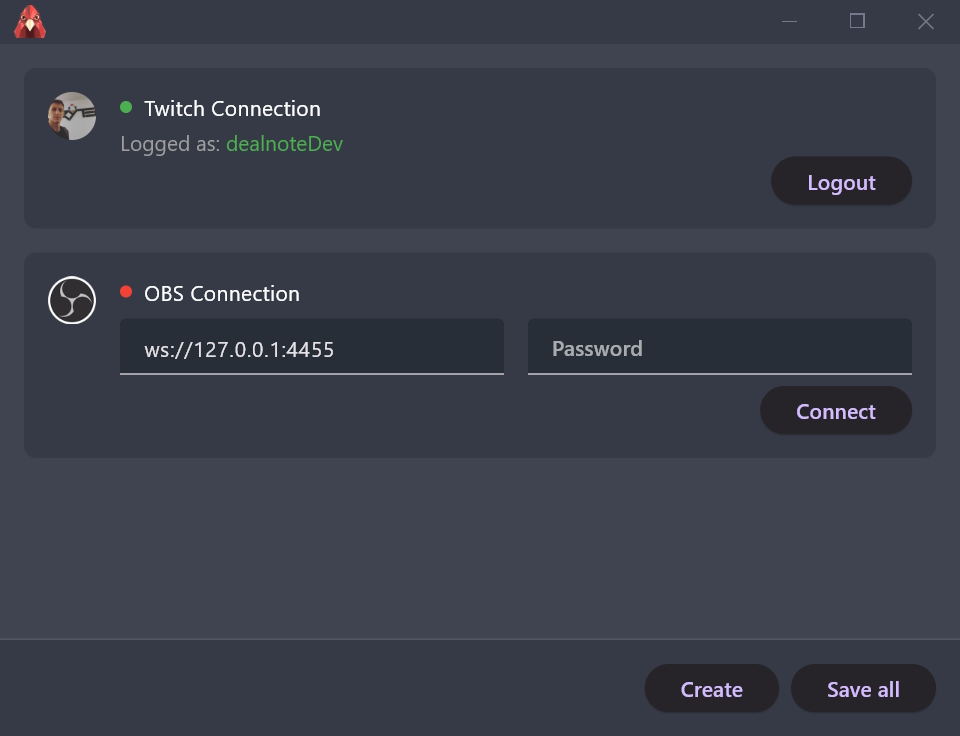
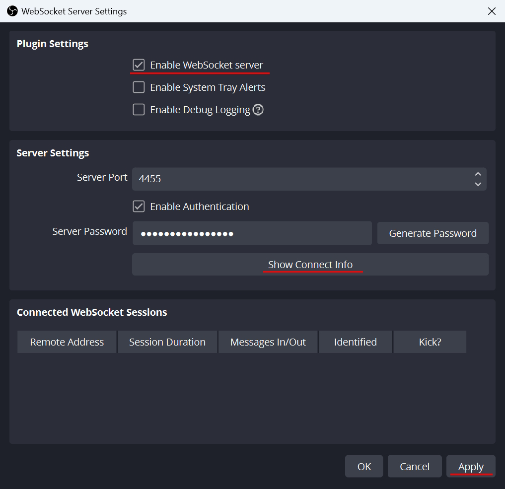
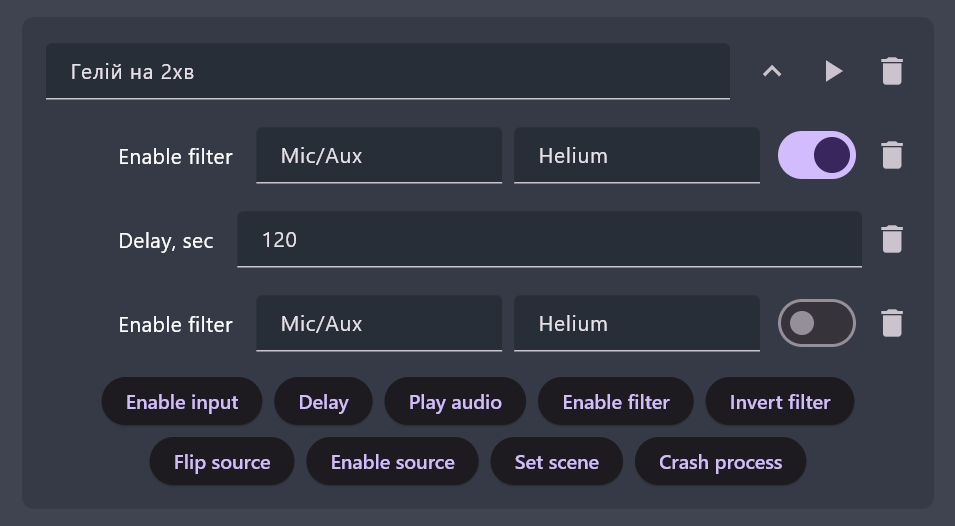

<div align="center">
  

  # Twitch Listener

  **Turn Twitch Channel Point rewards into automated OBS actions.**

  Build reaction chains that change scenes, toggle sources and filters, play audio,
  send input, and more — directly from a lightweight Windows desktop app.

  [](https://flutter.dev/)
  [](https://www.twitch.tv/)
  [](https://obsproject.com/)

  [Download the latest release](https://github.com/dealnotedev/twitch_rewards_app/releases) · [Українська інструкція](README_uk.md)
</div>

---



## What it does

Twitch Listener watches your channel for custom Channel Point reward redemptions. When a reward title matches a configured entry, the app runs its reaction chain from top to bottom.

For example, a **Helium voice** reward can enable an OBS microphone filter, wait two minutes, and disable the filter again — without any manual scene management during the stream.

### Available reactions

| Reaction | What it does |
| --- | --- |
| **Toggle input** | Mutes or unmutes an OBS audio input, such as a microphone. |
| **Delay** | Waits for a configurable number of milliseconds before the next reaction. |
| **Play audio files** | Plays one or more local audio files, with volume, shuffle, track-count, and wait-for-completion options. |
| **Toggle filter** | Enables, disables, or toggles an OBS source filter. |
| **Toggle source** | Shows, hides, or toggles a source, including sources inside OBS groups. |
| **Flip source** | Mirrors an OBS source horizontally, vertically, or both. |
| **Set scene** | Switches to the next scene in a configured list. |
| **Send input** | Replays a recorded keyboard/input combination. |
| **Crash process** | Force-terminates a selected Windows process. Use with care. |

Reaction chains and connection settings are stored locally. Reward configurations use SQLite, and older configurations are migrated automatically.

## Quick start

### 1. Install and sign in

1. Download the newest `.zip` from [GitHub Releases](https://github.com/dealnotedev/twitch_rewards_app/releases).
2. Extract the whole archive to a folder of your choice.
3. Run `twitch_listener.exe`.
4. Select **Login** and approve the requested Twitch permissions in your browser.

> [!NOTE]
> Twitch authentication uses a temporary callback on `localhost:3000`. If login cannot complete, check whether another application is already using that port or whether a firewall is blocking it.

### 2. Connect OBS

Twitch Listener uses **OBS WebSocket v5**, which is built into OBS Studio 28 and newer.

1. In OBS, open **Tools → WebSocket Server Settings**.
2. Enable the WebSocket server.
3. Keep the default port `4455`, or note your custom port.
4. Select **Show Connect Info** and copy the password.
5. In Twitch Listener, enter `ws://127.0.0.1:4455` and the password, then select **Apply**.
6. Confirm that the OBS status changes to **Connected**.



### 3. Create your first reward chain

1. Create a custom Channel Point reward in Twitch.
2. In Twitch Listener, select **Add New Reward**.
3. Enter the reward title **exactly as it appears on Twitch**.
4. Add reactions in the order they should run.
5. Save the configuration and ensure the reward is active.
6. Use the play button to test the chain before going live.

> [!TIP]
> OBS scene, source, input, and filter names must also match exactly. Test each chain with OBS connected before relying on it during a stream.

## Example: temporary voice filter

1. Add a voice filter to your microphone in OBS and leave it disabled.
2. Create a Twitch reward with the same title in Twitch Listener.
3. Add **Toggle filter → Enable** for the microphone and filter.
4. Add a **Delay** (for example, `120000` ms for two minutes).
5. Add **Toggle filter → Disable** for the same filter.
6. Save and test the chain.



## Safety notes

- **Crash process** terminates a process immediately and may cause unsaved work or system instability. Avoid critical Windows, OBS, and broadcast-related processes.
- **Send input** controls the active Windows session. Make sure the intended window will have focus when the reaction runs.
- The app stores Twitch credentials and the OBS WebSocket password locally on the computer. Do not share your application-data files or screenshots containing secrets.
- Keep a manual fallback available for scene and audio control during a live broadcast.

## Development

### Requirements

- Windows 10 or 11
- Flutter stable with Dart `>=3.2.5 <4.0.0`
- Visual Studio with the **Desktop development with C++** workload
- OBS Studio 28+ for integration testing

### Run locally

```powershell
flutter pub get
flutter run -d windows
```

### Quality checks

```powershell
flutter analyze
flutter test
```

### Build a release

```powershell
$env:NO_OPUS_OGG_LIBS = "1"
flutter build windows --release
```

The release bundle is generated in `build\windows\x64\runner\Release`. Distribute the complete folder, not only the `.exe`, because the application depends on the DLLs and data files beside it.

## Project structure

```text
lib/
├── actions/          # Reaction editors and action-specific UI
├── obs/              # OBS WebSocket connection and commands
├── twitch/           # OAuth, Twitch API, and EventSub WebSocket handling
├── reward*.dart      # Reward model, configuration, execution, and storage
└── main.dart         # Application entry point and event coordination
test/                 # Automated tests
windows/              # Native Windows runner
assets/               # Runtime icons and bundled assets
images/               # Documentation screenshots
```

## Troubleshooting

<details>
<summary><strong>Twitch login does not return to the app</strong></summary>

Close anything using port `3000`, allow the app through the firewall, and try **Login** again. Keep the app open while completing authorization in the browser.
</details>

<details>
<summary><strong>OBS remains disconnected</strong></summary>

Check that the WebSocket server is enabled, the URL starts with `ws://`, the port matches OBS, and the password has no extra spaces. For a local OBS instance, try `ws://127.0.0.1:4455`.
</details>

<details>
<summary><strong>A reward is redeemed but nothing happens</strong></summary>

Verify that Twitch and OBS are connected, the reward is active, and its title exactly matches the Twitch reward. Then test the chain with the play button and check every OBS object name.
</details>

<details>
<summary><strong>The built application does not start on another PC</strong></summary>

Copy the entire release folder. A standalone `twitch_listener.exe` is not a complete Windows build.
</details>

---

<div align="center">
  Built with Flutter, Twitch EventSub, and OBS WebSocket.
</div>
