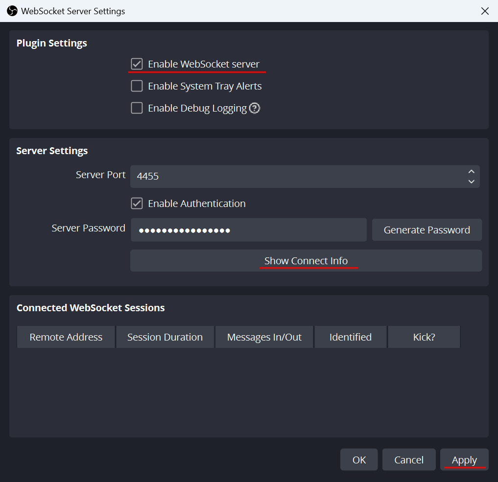

# Twitch Rewards App

Простий застосунок для маніпулювання налаштуваннями OBS використовуючи бали каналу.

## Базове налаштування

1. Завантажте актуальний білд застосунку (.zip архів) тут [Releases](https://github.com/dealnotedev/twitch_rewards_app/releases).
2. Розпакуйте архів в зручне для вас місце на диску і запустіть twitch_listener.exe.

3. Авторизуйтесь на Twitch, ознайомившись з правами, які ви надасте застосунку.

4. Після успішної авторизації в браузері ви маєте побачити наступне.

5. А в застосунку - наступне.

6. Для взаємодії з OBS використовується вбудований WebSocket сервер. За замовчуванням він вимкнений. Відкрийте OBS і перейдіть в налаштування WebSocket Server Settings.

7. Активуйте WebSocket сервер, в Show Connect Info скопіюйте пароль і збережість налаштування.

8. В застосунку введіть пароль від OBS WebSocket серверу і підлючіться кнопкою Connect. Якщо все правильно зробили - в OBS WebSocket Server Settings побачите нову сесію, а в застосунку - зелений індикатор.

9. Готово. Програма готова для роботи :)