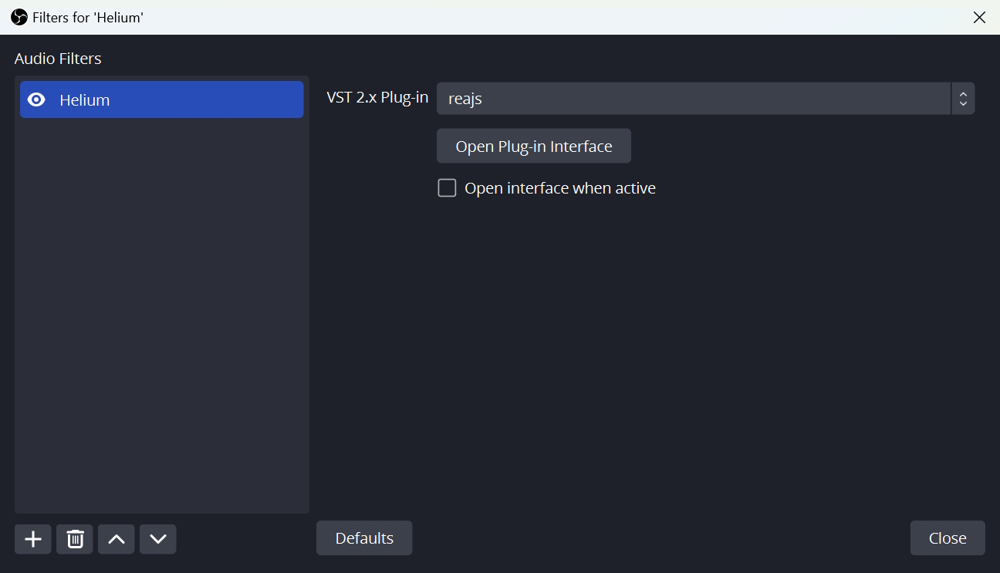
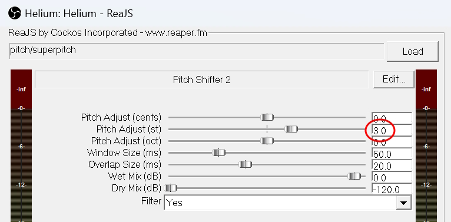

# Twitch Rewards App

Простий застосунок для маніпулювання налаштуваннями OBS використовуючи бали каналу.

## Базове налаштування

1. Завантажте актуальний білд застосунку (.zip архів) тут [Releases](https://github.com/dealnotedev/twitch_rewards_app/releases).
2. Розпакуйте архів в зручне для вас місце на диску і запустіть twitch_listener.exe.

3. Авторизуйтесь на Twitch, ознайомившись з правами, які ви надасте застосунку.

4. Після успішної авторизації в браузері ви маєте побачити наступне.

5. А в застосунку - наступне.

6. Для взаємодії з OBS використовується вбудований WebSocket сервер. За замовчуванням він вимкнений. Відкрийте OBS і перейдіть в налаштування WebSocket Server Settings.

7. Активуйте WebSocket сервер, в Show Connect Info скопіюйте пароль і збережість налаштування.

8. В застосунку введіть пароль від OBS WebSocket серверу і підлючіться кнопкою Connect. Якщо все правильно зробили - в OBS WebSocket Server Settings побачите нову сесію, а в застосунку - зелений індикатор.

9. Готово. Програма готова для роботи :)

## Що далі?
1. Спробуйте створити перший обробник Rewards & Challenges. Натискаєте кнопку Create, вводите назву кнопки (має бути точно така, як на Twitch) і додаєте послідовність реакцій.

2. Далі створюєте послідовність дій, яка буде затосована у разі натискання на кнопку. Наприклад, включаємо фільтр для елементу на сцені на 2 хвилини.

3. Обов'язково натисніть Save all
4. Перевірте як це працює кнопкою Play або через чат на Twitch

## Які можливості є на даний момент?
1. Enable input - активувати/деактивувати пристрій із Audio Mixer (мікрофон тощо)
2. Delay - просто затримка в секундах до наступної дії
3. Play audio - програвання аудіо-файлу в форматі .wav
4. Enable filter - активувати/деактивувати фільтр на елементі сцени (Sources)
5. Invert filter - змінити статус фільтру на протилежний (активувати якщо деактивовано і навпаки)
6. Flip source - відобразити елемент на сцені по осі X або/та Y. Дзеркало.
7. Enable source - показати/сховати елемент на сцені.
8. Set scene - перемкнути активну сцену.

## Як зробити гелій або інші фільтри голосу?
1. Завантажте і встановіть потрібний фільтр, наприклад https://www.reaper.fm/reaplugs/ або https://aegeanmusic.com/pitchproof-specs.
2. Накладіть на ваш мікрофон потрібний фільтр і вимкніть його.
   
3. Для прикладу додам налаштування "Гелію" для https://www.reaper.fm/reaplugs/
   
4. Створюємо обробник в застосунку, де будемо вмикати доданий "гелієвий" фільтр. А через 2 хвилини перемикаємо назад.
   
5. Зберігаємо і перевіряємо

## (ЗАСТАРІЛО) Як зробити гелій або інші фільтри голосу?
1. Завантажте і встановіть потрібний фільтр, наприклад https://www.reaper.fm/reaplugs/ або https://aegeanmusic.com/pitchproof-specs.
2. Додайте ще один мікрофон (копію вашого) в налаштуваннях OBS

3. Перейменуйте його як вам зручно і вимкніть.

4. Накладіть на нього потрібний фільтр.

5. Для прикладу додам налаштування "Гелію" для https://www.reaper.fm/reaplugs/

6. Створюємо обробник в застосунку, де будемо вимикати головний мікрофон і вмикати "гелієвий". А через 2 хвилини перемикаємо назад.

7. Зберігаємо і перевіряємо